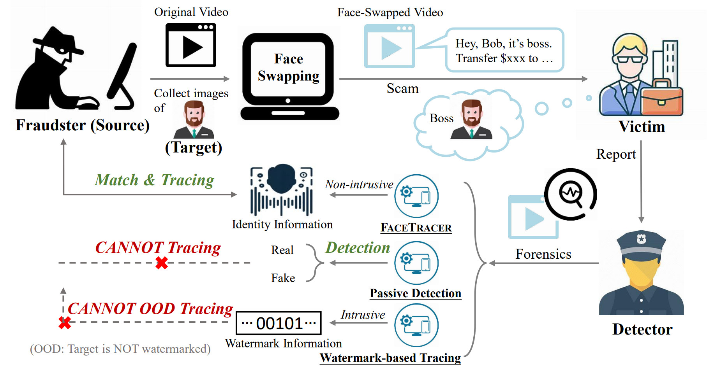

# FaceTracer

Official Pytorch Implementation of Paper: 'FaceTracer: Unveiling Source Identity from Swapped Face Images and Videos for Fraud Prevention' (TPAMI 25)

## 📄 Abstract

Face-swapping techniques have advanced rapidly with the evolution of deep learning, leading to widespread use and growing concerns about potential misuse, especially in cases of fraud. While many efforts have focused on detecting swapped face images or videos, these methods are insufficient for tracing the malicious users behind fraudulent activities. Intrusive watermark-based approaches also fail to trace unmarked identities, limiting their practical utility. To address these challenges, we introduce
FaceTracer, the first non-intrusive framework specifically designed to trace the identity of the source person from swapped face images or videos. Specifically, FaceTracer leverages a disentanglement module that effectively suppresses identity information related to the target person while isolating the identity features of the source person. This allows us to extract robust identity information that can directly link the swapped face back to the original individual, aiding in uncovering the actors behind fraudulent activities. Extensive experiments demonstrate FaceTracer’s effectiveness across various face-swapping techniques, successfully identifying the source person in swapped content and enabling the tracing of malicious actors involved in fraudulent activities. Additionally, FaceTracer shows strong transferability to unseen face-swapping methods including commercial applications and robustness against transmission distortions and adaptive attacks.

---

## 🖼️ Overview

<div align="center">
  
  <p><em>Figure 1. FaceTracer can achieve non-intrusive tracing to unveil the fraudster (source) identities for effective forensics.</em></p>
</div>


<div align="center">
  
  <p><em>Figure 2. FaceTracer consists of three designs: a) identity information extraction module aims to extracts crude identity embedding from the input image, b) identity information disentanglement module eliminates the influence of the identity information from the target person, and c) identity information enhancement module further enhances the discriminative capability. The red dotted line indicates the optimization of FaceTracer with the identity information enhancement module, which is also known as the AAMSoftmax loss.</em></p>
</div>  


---

## 📰 News

- **2025-08-20**: Paper accepted to TPAMI!

---

## ✅ To-Do List

- [ ] Release main code for training and testing

- [x] Release model checkpoints

- [ ] Release guidance to set up

---

## 🛠️ Usage Guide

### 1. Pretrained Models

Please download the pre-trained model from the following link.
| Path | Description
| :--- | :----------
|[HiRes](https://drive.google.com/drive/folders/1fbX8qnDgLexwGwmZAhzluMSUrfaLsZl0?usp=drive_link)  | FaceTracer model trained on face-swapping data generated by HiRes method.
|[FaceShifter](https://drive.google.com/drive/folders/1gvl7HqTyix70o7ULPtPmNiAmJ1mowG2l?usp=drive_link)  | FaceTracer model trained on face-swapping data generated by FaceShifter method.
|[SimSwap](https://drive.google.com/drive/folders/1CzXHHvIYckQEEkjpOfvNMITT5T2ljb8y?usp=drive_link)  | FaceTracer model trained on face-swapping data generated by SimSwap method.
|[InfoSwap](https://drive.google.com/drive/folders/1bER0lgQTyGDEt4dSpZUR_otxa5KRlX9r?usp=drive_link)  | FaceTracer model trained on face-swapping data generated by InfoSwap method.
|[Mixture](https://drive.google.com/drive/folders/1PvzFYUaP5fGVLcYsr6n1XRURY3-pjI0m?usp=drive_link)  | FaceTracer model trained on mixed face-swapping data generated by the above four methods.

---

## 🤝 Citation

If you find this work useful, please cite our paper:

```bibtex
@ARTICLE{11131668,
  author={Zhang, Zhongyi and Zhang, Jie and Zhou, Wenbo and Zhou, Xinghui and Guo, Qing and Zhang, Weiming and Zhang, Tianwei and Yu, Nenghai},
  journal={IEEE Transactions on Pattern Analysis and Machine Intelligence}, 
  title={FACETRACER: Unveiling Source Identities from Swapped Face Images and Videos for Fraud Prevention}, 
  year={2025},
  volume={},
  number={},
  pages={1-17},
  keywords={Faces;Videos;Data mining;Training;Fraud;Forensics;Facial features;Watermarking;Distortion;Artificial intelligence;DeepFake;Fraud Prevention;Identity Tracing},
  doi={10.1109/TPAMI.2025.3601141}}

```

*Note: We will release the full code and checkpoints no later than October 31st, stay tuned! Thank you for your interests!!*
